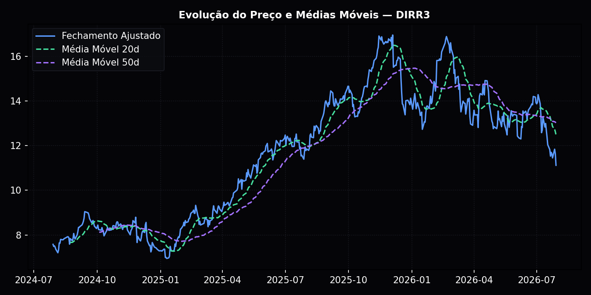
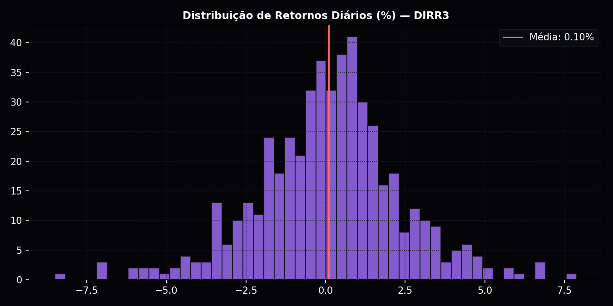

<div align="center">
  
  <h1>Ceará Finance — Hub Integrado de Valuations & Equity Research</h1>
  <p><strong>Plataforma quantitativa e fundamentalista desenvolvida para análise de mercado de capitais, automação de equity research, monitoramento da CVM e backtest sistemático (B3 vs CDI).</strong></p>

  <p>
    
    
    
    
  </p>
</div>

---

## 💡 O que é este projeto?
Este repositório contém o código-fonte da plataforma integrada de inteligência de mercado financeiro da **Ceará Finance**. 

O sistema foi concebido com uma **arquitetura descentralizada de 7 micro-sites independentes** (cada um rodando em sua própria porta local com cache em RAM dedicado), permitindo processamento em tempo real sem lentidão ou bloqueios de requisições.

---

## 🏛️ Estrutura dos 7 Micro-Sites

| Aplicação | Porta Local | Descrição e Funcionalidades |
| :--- | :---: | :--- |
| 🌐 **Portal Central (Hub)** | `8000` | Landing page institucional com cartões de acesso direto, monitoramento de saúde de cada servidor e navegação centralizada. |
| 🤖 **Alertas & Consultas CVM** | `8001` | Monitoramento regulatório em tempo real via SQLite. Fatos Relevantes, Comunicados ao Mercado, busca por ticker (`DIRR3`, `PETR4`, `VALE3`, `WEGE3`) e resumos via IA. |
| 📊 **Monitor de Valuation (Mira)** | `8002` | Planilha interativa com **cache em memória RAM** (< 2ms). Filtros dinâmicos estilo Excel (setor, DY, ROE, P/L, teto de Graham e Bazin) e exportação para CSV. |
| 📋 **Equity Research & Demonstrativos** | `8003` | Lâminas de tese no formato acadêmico Poli USP (drivers, riscos e preços-alvo) e séries históricas de 5 anos (DRE, Balanço Patrimonial e DFC). |
| 🏛️ **Workstation Gregori Markets** | `8004` | Terminal quantitativo financeiro e interface de análise de mercado integrada. |
| ⚙️ **CF Tech Valuation Pipelines** | `8005` | Motor de WACC Beta OLS, DCF com crescimento perpétuo, simulação estocástica de Monte Carlo (10.000 iterações) e auditoria de anomalias contábeis. |
| 🛡️ **Aegis Momentum Backtest** | `8501` | Laboratório Streamlit para testes de hipótese e estratégias sistemáticas de Momentum Long-Short comparadas ao CDI. |

---

## 📊 Visualizações e Análises Geradas

<div align="center">
  
  
</div>

---

## 🚀 Como Executar em seu Computador

### 1. Clonar o Repositório
```bash
git clone https://github.com/jackrj090603-prog/investimentos.git
cd investimentos
```

### 2. Instalar Dependências
```bash
pip install pandas numpy yfinance matplotlib seaborn streamlit requests beautifulsoup4 openpyxl lxml markdown telethon pyyaml pyarrow tabulate
```

### 3. Configurar Credenciais (Opcional)
Copie o arquivo de exemplo e insira suas chaves do Google AI Studio e Telegram:
```bash
cp agente_cvm/.env.example agente_cvm/.env
```

### 4. Inicialização com 1 Clique (Windows)
Dê um duplo clique no arquivo:
👉 **`iniciar_sistema.bat`**

Ou via terminal:
```bash
python iniciar_todos_sites.py
```
O orquestrador liberará as portas automaticamente e iniciará todos os 7 servidores.

---

## 🌐 Links Locais de Acesso (Após Iniciar)
- **Portal Central**: [http://localhost:8000](http://localhost:8000)
- **Alertas CVM**: [http://localhost:8001](http://localhost:8001)
- **Valuation Mira**: [http://localhost:8002](http://localhost:8002)
- **Equity Research**: [http://localhost:8003](http://localhost:8003)
- **Workstation**: [http://localhost:8004](http://localhost:8004)
- **CF Tech Pipelines**: [http://localhost:8005](http://localhost:8005)
- **Aegis Backtest (Streamlit)**: [http://localhost:8501](http://localhost:8501)

Para encerrar todos os processos a qualquer momento:
```bash
python parar_todos_sites.py
```

---

## 👥 Realização
**Ceará Finance** • Liga Acadêmica de Mercado Financeiro da UFC
